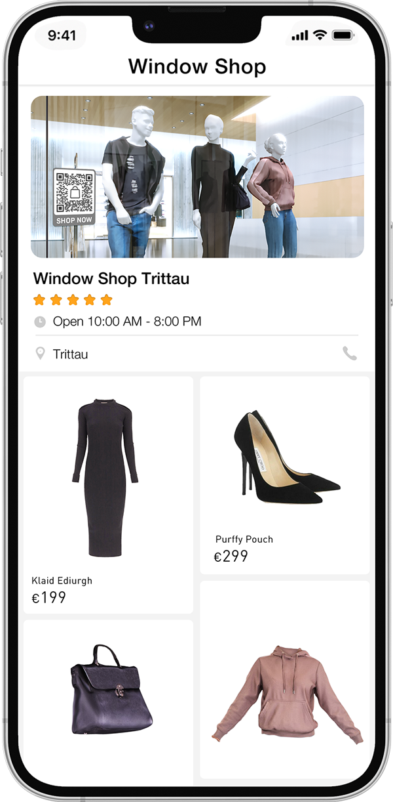
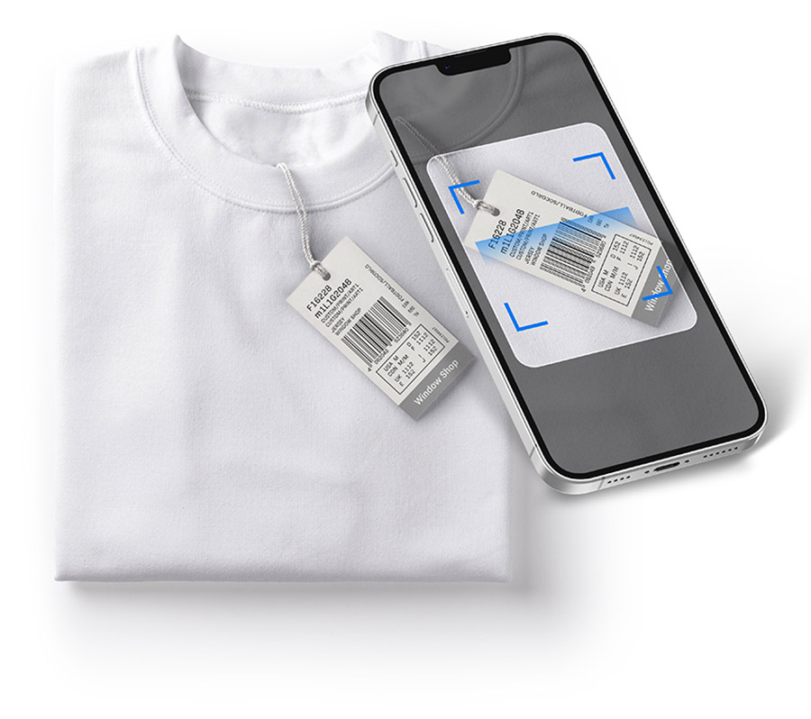

NEW

<h1>Window Shop is here.</h1>

    
    
    

<h2>Nothing can stop your customers from buying.</h2>

Let your customers instantly buy the products they see in your window at the scan of a QR
            sticker.

    

        
1

        
Add sticker to your window.

        
The QR sticker links your products to your online Window Shop page.

    

    

    

        
2

        
Scan barcodes of your products.

        
Update your online Window Shop products by scanning the barcodes of your
            products
            with your mobile device or tablet. No app required.

        

    

    

        
3

        
Sell!

        
Your Window Shop is directly integrated with your E-commerce Shop.

    

    
    

    
Keep your shops synced - worldwide

    

        
My window shops

        
London

        
Paris

        
Berlin

        
New York

        
Shanghai

    

